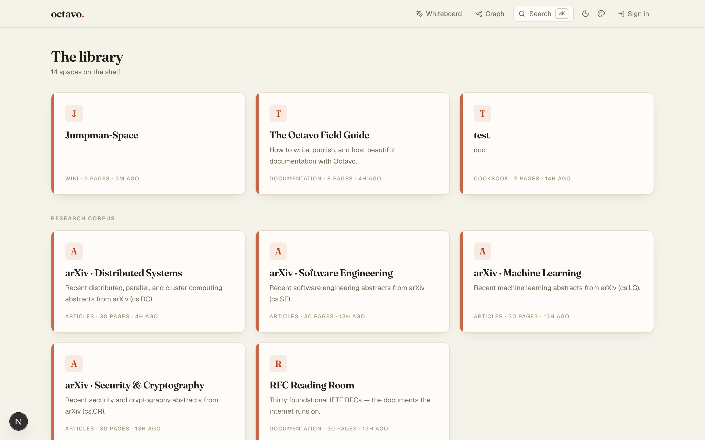
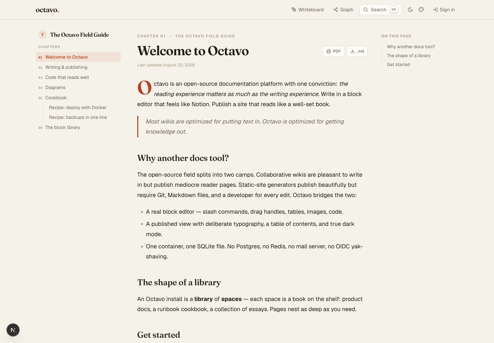
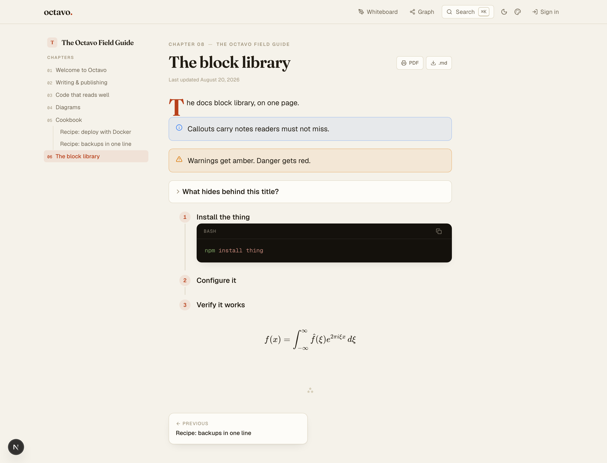
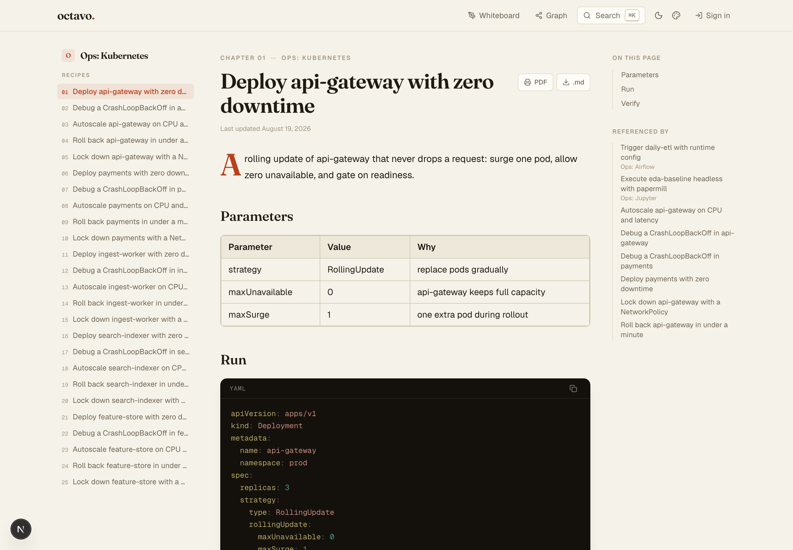
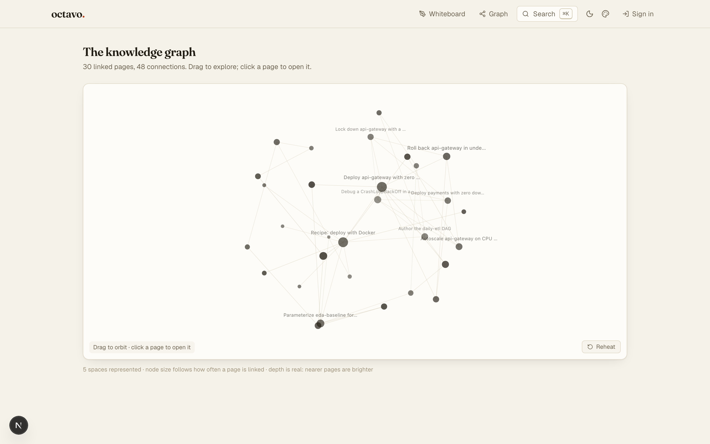
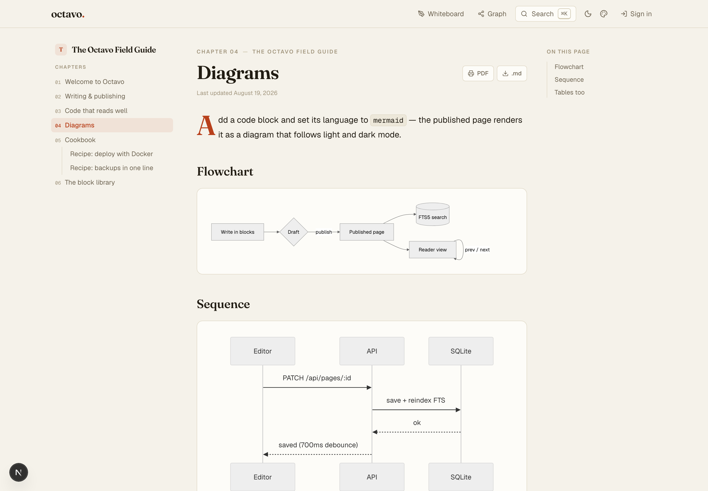

# octavo

**Open-source documentation that reads like a book.**

Write like Notion. Publish like a press. Host it anywhere for free — one
container, one SQLite file, zero external services.



## What it looks like

| | |
|---|---|
|  |  |
| **Reading** — chapter numbering, drop caps, an on-this-page rail, page turns | **Blocks** — callouts, expandables, steps, math, diagrams |
|  |  |
| **Cookbooks** — parameters, code, and a Run button wired to real systems | **The graph** — every link between pages, in three dimensions |



## Why

The open-source documentation field splits into two camps that never meet:

- **Collaborative wikis** (Wiki.js, BookStack, Docmost, Outline) are pleasant
  to write in but publish mediocre reader-facing pages — and most demand
  Postgres + Redis + a mail server + an OIDC provider before you type a word.
  Some aren't even open source (Outline is BSL); some paywall SSO and their
  own API.
- **Static-site generators** (Docusaurus, MkDocs Material, Starlight) publish
  beautifully but have no editor, no collaboration, and require a developer
  and a Git workflow for every edit.

Octavo bridges the two: a real block editor on the way in, deliberate
book-grade typography on the way out, and a deployment story that fits in a
tweet.

## Features

- **Notion-class block editor** — slash commands, drag handles, headings,
  lists, checklists, quotes, tables, images, files. Autosaves as you type.
  Paste screenshots straight in.
- **A published view that respects readers** — chapter numbering, drop caps,
  a numbered table of contents with dotted leaders, an "on this page" rail
  with scroll-spy, previous/next page turns, and true dark mode (warm paper
  by day, warm ink by night — not an inverted afterthought).
- **Code in every language** — server-side Shiki highlighting (the VS Code
  engine), language label, copy button, always set on a dark ground.
- **Diagrams built in** — set a code block's language to `mermaid` and the
  published page renders it, theme-aware. The `/whiteboard` has two drafting
  tables: freehand **Excalidraw** sketching and the full **draw.io** editor
  (the same engine Confluence charges for — free here) — throw a drawing
  away or export it as an image.
- **Templates for engineers of all stripes** — product docs, SRE runbooks
  with postmortems, DevOps playbooks, API references, data-science project
  logs, network engineering change docs, architecture decision records,
  engineering notebooks. Every template seeds structured draft pages.
- **Private and public spaces** — spaces are private (members only) by
  default; flip one public to share a cookbook with the world. Drafts stay
  invisible until published; published URLs never change.
- **Discussion where it belongs** — comment threads under technical docs,
  wikis, and articles so teams can collaborate in the margins; cookbooks
  stay clean and executable.
- **Search that works** — SQLite FTS5 with BM25 ranking, prefix matching,
  highlighted snippets, cmd+K everywhere. Private content never leaks into
  anonymous search.
- **Local accounts out of the box** — no OIDC yak-shaving. First visit
  creates the admin.
- **One-file operations** — everything lives in `/data/octavo.db` (uploads
  beside it). Backups:

  ```bash
  sqlite3 /data/octavo.db ".backup /backups/octavo-$(date +%F).db"
  ```

## Is Octavo right for you?

[COMPARISON.md](COMPARISON.md) is an honest look at where Octavo stands
against BookStack, Docmost, Outline, Wiki.js, and the hosted tools —
including the reasons to choose one of them instead, and the gaps we have
not closed yet.

## The covenant

Octavo holds these as promises, not features. Breaking one is a bug of the
highest severity.

1. **Your writing outlives Octavo.** Every page exports as plain Markdown,
   every space as a zip you can read with `unzip` and `cat`. The SQLite
   schema is boring on purpose.
2. **Private means private.** Membership-scoped queries everywhere; nothing
   private ever touches public search, trees, or exports.
3. **No phone-home.** Octavo makes no network calls you didn't ask for.
4. **The default theme never changes out from under you**, and the reading
   experience is never traded away for a dashboard.
5. **Nothing load-bearing goes behind a paywall.** SSO, export, the API —
   core, forever. AGPL keeps hosted copies honest.

## Run it

```bash
docker compose up -d
# then open http://localhost:3000 — the first visit creates your admin account
```

On Kubernetes or OpenShift:

```bash
helm install octavo ./charts/octavo \
  --set persistence.size=10Gi
kubectl port-forward svc/octavo 3000:3000
```

Or for development:

```bash
npm install
npm run dev
```

## Stack

Next.js (App Router) · React · TypeScript · Tailwind · BlockNote
(ProseMirror) · better-sqlite3 + FTS5 · Shiki · Mermaid · Excalidraw.
No ORM, no message queue, no cache server. `data/` is the whole state.

## Roadmap

The full themed roadmap lives in [ROADMAP.md](ROADMAP.md). Shipped so far:
the editor, the book-grade reader, whiteboards, templates, search, shelves,
export/import, discussions, themes, OIDC SSO, version history, and llms.txt.

Next up — the collaboration edition: the docs block library
(callouts/tabs/steppers/math), anchored comment threads, change requests
with diff views and merge rules, and notifications.

## License

AGPL-3.0. Free to run, free to host, free forever — improvements to hosted
copies come back to everyone.
